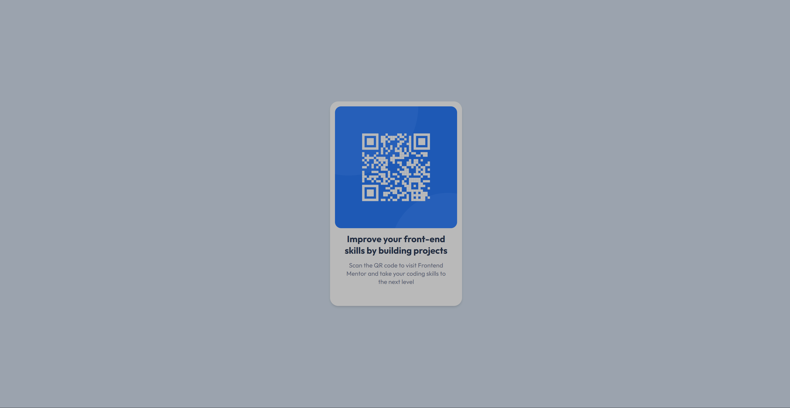

# Frontend Mentor - QR code component solution

This is a solution to the [QR code component challenge on Frontend Mentor](https://www.frontendmentor.io/challenges/qr-code-component-iux_sIO_H). Frontend Mentor challenges help you improve your coding skills by building realistic projects.

## Table of contents

- [Overview](#overview)
  - [Screenshot](#screenshot)
  - [Links](#links)
- [My process](#my-process)
  - [Built with](#built-with)
  - [What I learned](#what-i-learned)
- [Author](#author)

## Overview

### Screenshot

### Links

- Solution URL: [Github](https://github.com/yutinglia/frontend-mentor-solutions/tree/main/src/routes/challenges/qr-code-component)
- Live Site URL: [Github Page](https://yutinglia.github.io/frontend-mentor-solutions/challenges/qr-code-component)

## My process

### Built with

- Flexbox
- [Svelte 5](https://svelte-5-preview.vercel.app/docs/introduction) - JS library
- [SvelteKit](https://kit.svelte.dev/) - Svelte framework
- [Tailwind CSS](https://tailwindcss.com/) - For styles

### What I learned

Basic Tailwind CSS and Svelte knowledge.

## Author

- Website - [Lai Yu Ting](https://github.com/yutinglia)
- Frontend Mentor - [@yutinglia](https://www.frontendmentor.io/profile/yutinglia)
